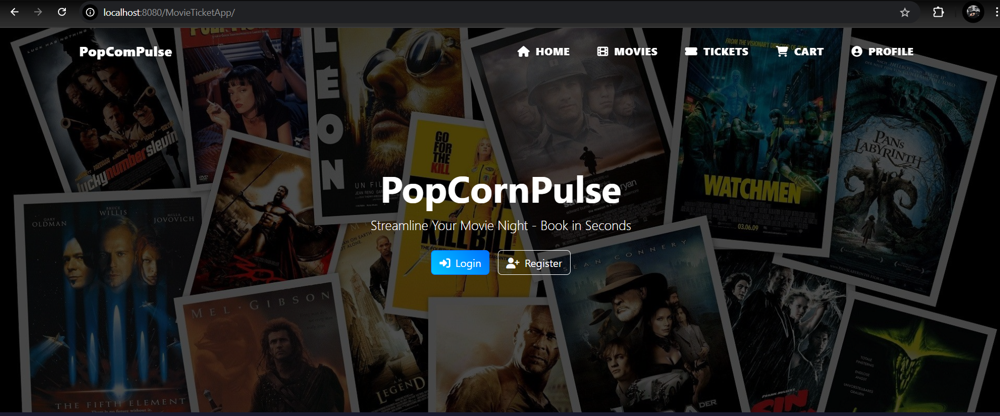
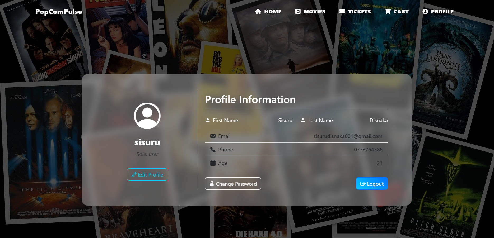
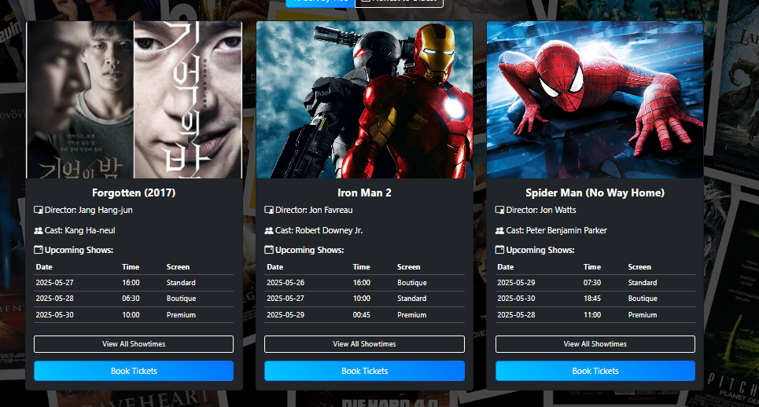
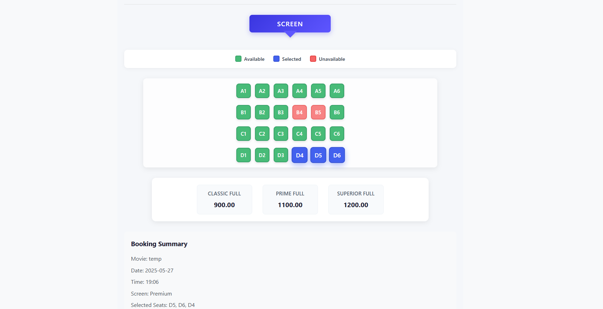
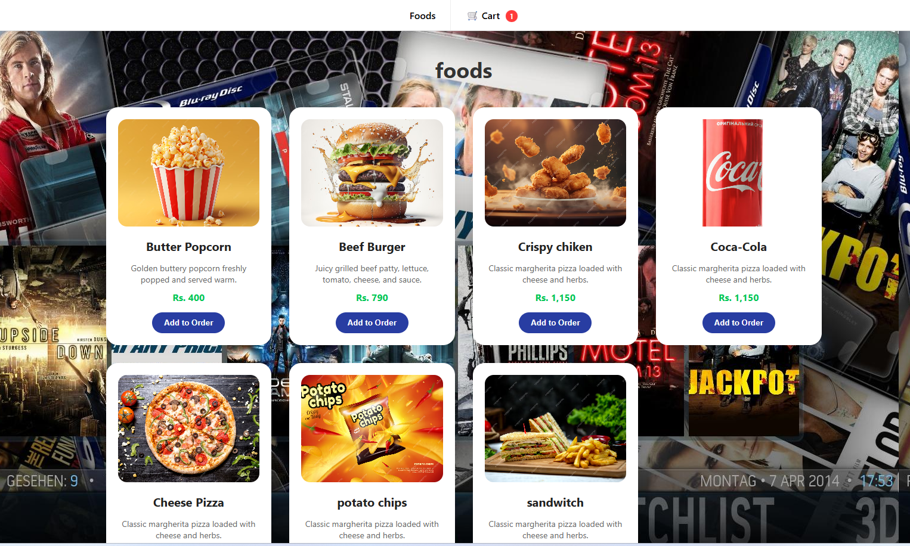
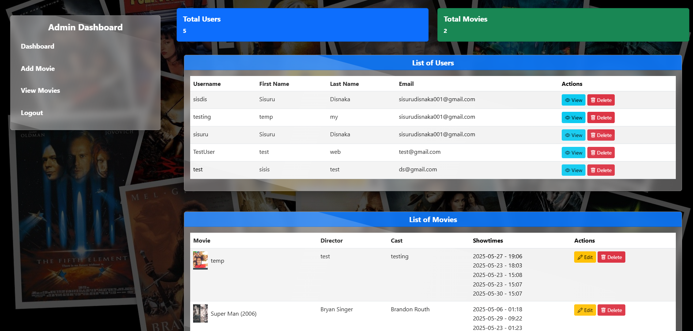
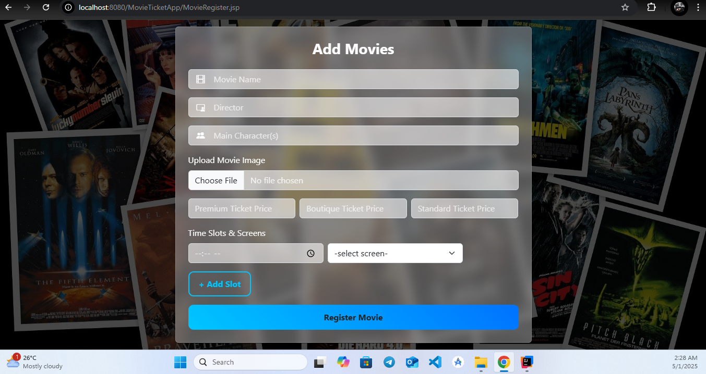
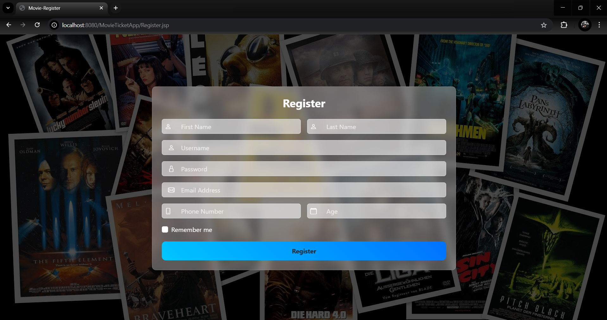

# 🍿 PopCornPlus  
---


JSP + Servlet | File-Based Storage | Modular Architecture  
Developed as a Group Project | Deployed on Apache Tomcat

---

## 📘 Overview  

**PopCornPlus** is a **Movie Ticket Reservation Web Application** built using **Java (JSP + Servlets)**, following **OOP** and **MVC** principles with **file-based data storage** (no database).  

Users can browse movies, view showtimes, book tickets, make payments, give reviews, and manage their profiles - all within a clean, responsive web interface.  

---

## 🚀 Key Features  

### 🎞️ Movie Management  
- Add, update, and delete movies  
- View detailed movie information  
- Manage movie showtimes and seats  

### 🪑 Theater Management  
- Manage showtimes and seat availability  
- Save and load bookings from files  
- Ticket generation and updates
- Order foods  while book tickets

### 🛒 Cart & Payment  
- Add movies to cart  
- Process payments using file-based data  
- Update or remove cart items  

### 💬 Reviews & Feedback  
- Add, edit, and delete user feedback  
- View all movie reviews  
- Simple text-based persistence  

### 👤 User Management  
- Register, login, and manage profiles  
- Admin and user role separation  
- Password change, edit profile, and delete account  

---

## 🧠 Concepts Implemented  

✅ Object-Oriented Programming  
> Encapsulation | Inheritance | Polymorphism | Abstraction  

✅ Java File Handling  
> Read/Write with `FileReader`, `FileWriter`, `BufferedReader`, `BufferedWriter`  

✅ MVC Pattern  
> - **Model** → Java classes (data objects)  
> - **View** → JSP pages  
> - **Controller** → Servlets handling logic  

✅ Session Management  
> Using `HttpSession` for login sessions and cart tracking  

✅ Frontend  
> HTML • CSS • Bootstrap • JSTL (JSP Standard Tag Library)  

---

## 🧰 Tech Stack  

| Category | Technologies Used |
|-----------|-------------------|
| 💻 Backend | Java, JSP, Servlets |
| 🗂️ Data Storage | File-Based (`.txt` files) |
| 🧭 Architecture | MVC (Model–View–Controller) |
| 🎨 Frontend | HTML, CSS, Bootstrap, JSTL |
| 🔐 Session | HttpSession |
| 🧱 Server | Apache Tomcat 9+ |
| 🧠 IDE | IntelliJ IDEA |
| 🪣 Version Control | Git + GitHub |

---

## 🏗️ Project Structure

```bash
src/main/
├── java/com/
│   ├── CartAndPayment/
│   │   ├── dao/
│   │   │   └── paymentdao.java
│   │   ├── model/
│   │   │   ├── cartitem.java
│   │   │   ├── payment.java
│   │   │   ├── product.java
│   │   │   └── shoppingcart.java
│   │   ├── service/
│   │   │   ├── cartservice.java
│   │   │   └── paymentservice.java
│   │   └── servlet/
│   │       ├── AddMovieToCartServlet.java
│   │       ├── AddToCartServlet.java
│   │       ├── ProcessPaymentServlet.java
│   │       ├── UpdateCartServlet.java
│   │       └── ViewCartServlet.java
│   │ 
│   ├── Review_and_Feedback/
│   │   ├── model/
│   │   │   └── Review.java
│   │   ├── service/
│   │   │   └── ReviewService.java
│   │   └── servlet/
│   │       ├── CancelFeedbackServlet.java
│   │       ├── EditFeedbackServlet.java
│   │       ├── FeedbackServlet.java
│   │       └── ReadReviewsServlet.java
│   │ 
│   ├── Ticket/
│   │   ├── CancelTicketServlet.java
│   │   ├── TicketServlet.java
│   │   └── UpdateTicketServlet.java
│   │ 
│   ├── db/movieManage/
│   │   ├── DeleteMovieServlet.java
│   │   ├── Movie.java
│   │   ├── MovieDetailServlet.java
│   │   ├── MovieManager.java
│   │   ├── MovieServlet.java
│   │   ├── RegisterMovie.java
│   │   └── UpdateMovieServlet.java
│   │ 
│   ├── theaterManagement/
│   │   ├── controller/
│   │   │   ├── BookingSaveServlet.java
│   │   │   └── SeatAvailabilityServlet.java
│   │   ├── model/
│   │   │   ├── BookedSeats.java
│   │   │   ├── Booking.java
│   │   │   ├── Showtime.java
│   │   │   └── Theater.java
│   │   └── service/implement/
│   │       ├── BookingService.java
│   │       └── MovieService.java
│   │ 
│   └── userManage/
│       ├── dao/
│       │   ├── DeleteUserServlet.java
│       │   ├── UserDAO.java
│       │   └── UserDAOInterface.java
│       ├── factory/
│       │   ├── UserFactory.java
│       │   └── UserManagementFactory.java
│       ├── model/
│       │   ├── AbstractUser.java
│       │   ├── AdminUser.java
│       │   └── User.java
│       ├── service/
│       │   ├── UserService.java
│       │   ├── UserServiceImpl.java
│       │   └── ValidationService.java
│       └── servlet/
│           ├── AdminUserServlet.java
│           ├── ChangePasswordServlet.java
│           ├── EditProfileServlet.java
│           ├── LoginServlet.java
│           ├── RegisterServlet.java
│           ├── UpdateProfileServlet.java
│           └── UserProfileServlet.java
│
├── webapp/
│   ├── WEB-INF/
│   │   ├── jspSC/
│   │   │   ├── footer.jsp
│   │   │   └── header.jsp
│   │   ├── lib/
│   │   │   └── jstl-1.2.jar
│   │   ├── movies.txt
│   │   ├── payment.txt
│   │   ├── reviews.txt
│   │   ├── seats.txt
│   │   ├── theater.txt
│   │   ├── tickets.txt
│   │   ├── users.txt
│   │   └── web.xml
│   │
│   ├── images/
│   │   ├── icon.png
│   │   ├── img.jpg
│   │   ├── img1.jpg
│   │   ├── img2.jpg
│   │   └── movie-images/
│   └── *.jsp (UI Pages)
│
└── pom.xml
```
---
## 🖼️ Preview Screenshots

| Page | Screenshot |
|------|------------|
| 🎥 Home Page |  |
| 👤 User Profile |  |
| 📝 Movie Page |  |
| 🎟️ Seat Selection Page |  |
| 💳 Food Selection Page |  |
| 🧑‍💻 Admin Dashboard |  |
| ➕ Add Movie Page |  |
| 📝 Register New User Page |  |

---

## 📜 License

Licensed under the **MIT License** - free for educational and personal use.  
You may modify, reuse, and distribute this project **with attribution**.
see the [LICENSE](LICENSE) file for details.

---

## 👨‍💻 Authors

**Sisuru Disnaka** - [GitHub Profile](https://github.com/SisuruDisnaka)  
**Group Members** - SLIIT Year 1 Semester 2 Project  
**Sri Lanka Institute of Information Technology (SLIIT)**
